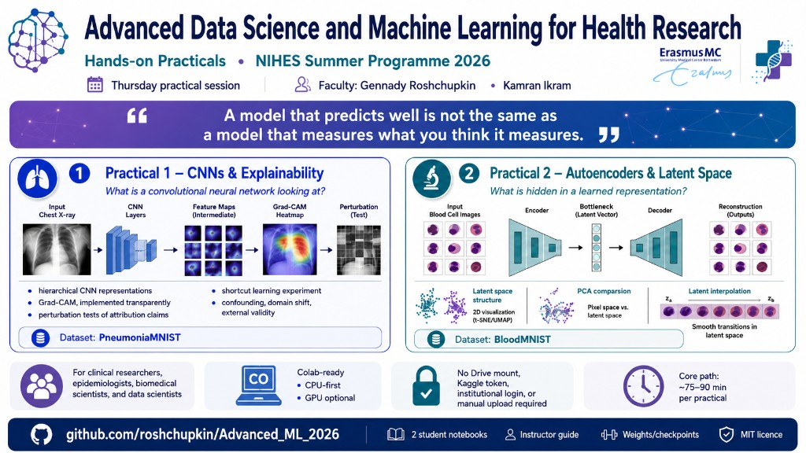

# Advanced Machine Learning for Health Research

**NIHES Summer Programme 2026**



Practical materials for the Advanced Machine Learning for Health Research course.

**Faculty:** Gennady Roshchupkin, Kamran Ikram

## Course week

| Day | Topic |
| --- | --- |
| Monday | Neural Networks & CNNs |
| Tuesday | Autoencoders |
| Wednesday | Diffusion Models |
| Thursday | **Hands-on practicals ← this repository** |
| Friday | Transformers & advanced applications |

These two notebooks are written for clinical researchers, epidemiologists, biomedical scientists, and data scientists who already know Python, basic machine learning, train/validation/test splitting, cross-validation, overfitting, regularization, and basic neural networks.

## Open in Colab

| Practical | Notebook | Colab |
| --- | --- | --- |
| 1 | What Is a Convolutional Neural Network Looking At? | [Open in Colab](https://colab.research.google.com/github/roshchupkin/Advanced_ML_2026/blob/main/01_CNN_Explainability_Health.ipynb) |
| 2 | What Is Hidden in a Learned Representation? | [Open in Colab](https://colab.research.google.com/github/roshchupkin/Advanced_ML_2026/blob/main/02_Autoencoder_Latent_Space_Health.ipynb) |

No Drive mount, Kaggle token, institutional login, or manual upload is required. Use a normal Google account and a fresh Colab runtime.

## What you will learn

Both practicals ask one scientific question:

> A model that predicts well is not the same as a model that measures what you think it measures.

### Practical 1 — CNNs and explainability (~75–90 min)

- hierarchical CNN representations and feature maps
- Grad-CAM (implemented transparently, not as a black-box library)
- perturbation tests of attribution claims
- a **simulated** shortcut-learning experiment
- confounding, domain shift, and external validity

**CORE:** feature maps → Grad-CAM → perturbation → shortcut experiment  
**EXTENSION:** optional challenges at the end

### Practical 2 — Autoencoders and latent representations (~75–90 min)

- encoder–decoder bottlenecks and reconstruction quality
- latent vectors as derived features
- PCA in pixel space versus latent space
- a **simulated** two-site acquisition/domain-shift experiment
- latent interpolation and a short bridge to latent diffusion

**CORE:** reconstruction → latent PCA → simulated site effect → latent interpolation  
**EXTENSION:** bottleneck size, harmonization, label efficiency, UMAP

## Computational design (CPU-first)

Designed for the worst case: a **CPU-only Colab runtime**. A GPU helps if present but is never required.

Approximate practical-wide requirements:

- downloads: about **101 MB** for the core path (plus ~1 MB instructor weights)
- peak RAM: about **2–2.5 GB**
- heavy compute if you retrain: about **6–10 CPU minutes** total

### Class default: do not retrain

Each notebook has explicit flags near the top of the setup:

```python
TRAIN_CLEAN = False       # Notebook 1
TRAIN_SHORTCUT = False    # Notebook 1
TRAIN_AUTOENCODER = False # Notebook 2
```

With these set to `False` (the class default), models load small committed checkpoints from [`weights/`](weights/). If a local copy is missing, the notebook downloads them from this repository automatically. Set a flag to `True` only if you want to reproduce training.

## Datasets

Public biomedical datasets from **MedMNIST / MedMNIST+** ([medmnist.com](https://medmnist.com/)):

- **PneumoniaMNIST (64×64)** — paediatric chest radiographs for Practical 1
- **BloodMNIST (28×28)** — peripheral blood cell microscopy for Practical 2

BloodMNIST is used because its small image size makes representation-learning experiments possible on CPU while retaining biologically meaningful visual heterogeneity.

These datasets are for **research and education**, not clinical use. Notebooks document provenance, licences, and citations, and label every simulated manipulation explicitly.

## Repository contents

- [`01_CNN_Explainability_Health.ipynb`](01_CNN_Explainability_Health.ipynb) — student Practical 1
- [`02_Autoencoder_Latent_Space_Health.ipynb`](02_Autoencoder_Latent_Space_Health.ipynb) — student Practical 2
- [`poster.png`](poster.png) — course overview graphic
- [`weights/`](weights/) — instructor fallback checkpoints (class panic button)
- [`README_Instructor.md`](README_Instructor.md) — timings, compute profile, citations, pre-course checklist, full exercise solutions
- [`LICENSE`](LICENSE) — MIT

## For instructors

Start with [`README_Instructor.md`](README_Instructor.md). It includes timing tables, smoke-test cells, known failure modes, and complete solutions. Before class, run both notebooks once in a fresh **CPU-only Colab** with `TRAIN_*=False`, and once with training enabled if you want to verify the retrain path.

## Citation

If you reuse the teaching materials or the underlying data, cite the MedMNIST papers and the source datasets as listed in the notebooks and the instructor guide (Yang et al., *Scientific Data* 2023; Kermany et al., *Cell* 2018; Acevedo et al., *Data in Brief* 2020).

## Licence

Teaching code and materials in this repository are released under the [MIT License](LICENSE). Dataset licences remain those of MedMNIST / the original source studies (typically CC BY 4.0; see each notebook).
